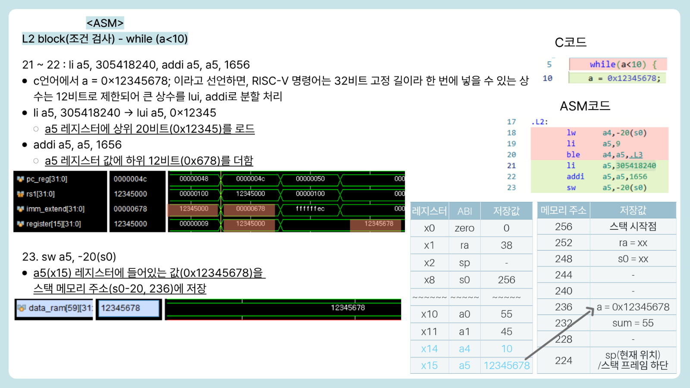
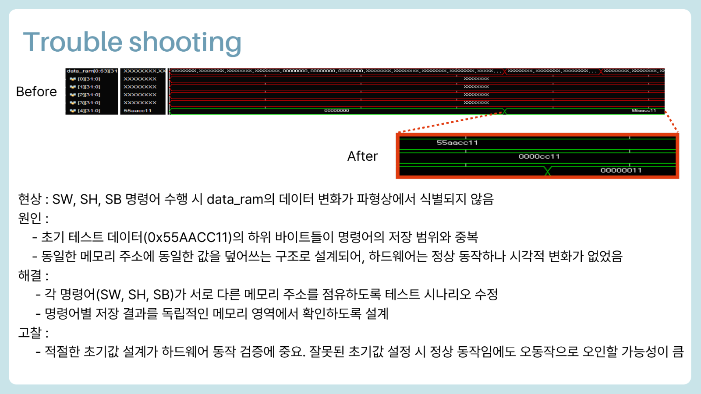

# RV32I Single-Cycle CPU

SystemVerilog로 **RISC-V RV32I 명령어 37개**를 구현한 Single-Cycle CPU입니다. 명령어 타입별 RTL 시뮬레이션과 C 코드 기반 누적합 프로그램 실행을 통해 Control Unit, Data Path, Memory, Program Counter의 통합 동작을 확인했습니다.

- 개발 기간: 2026.05.19 ~ 2026.05.27
- 개발 환경: Xilinx Vivado 2020.2, Vivado Simulator, RISC-V GCC
- 사용 언어: SystemVerilog, C, RISC-V Assembly
- 구현 구조: RV32I Single-Cycle CPU

## 1. 프로젝트 목표

- RV32I 명령어 형식을 해석해 CPU 제어 신호를 생성합니다.
- Program Counter, Register File, ALU, Immediate Generator, Memory를 하나의 Data Path로 연결합니다.
- 명령어 타입별 시뮬레이션으로 연산 결과와 제어 신호를 확인합니다.
- C 코드를 RISC-V 명령어로 변환해 직접 설계한 CPU에서 실행합니다.

## 2. 설계 구조


| 모듈 | 역할 |
| --- | --- |
| `top_rv32i_soc` | Instruction Memory, CPU, Data Memory 통합 |
| `rv32i_cpu` | Control Unit과 Data Path 연결 |
| `control_unit` | `opcode`, `funct3`, `funct7`을 해석해 제어 신호 생성 |
| `datapath` | PC, Register File, ALU, Immediate, Write Back 경로 구성 |
| `instruction_mem` | 32-bit 명령어 저장 및 PC 기반 명령어 출력 |
| `data_mem` | Byte, Half Word, Word 단위 Load/Store 처리 |

모든 명령어는 한 Clock Cycle 안에서 명령어 해석, 연산, Memory 접근, Write Back을 수행합니다. Clock Edge에서 Program Counter와 Register File, Data Memory가 갱신됩니다.

## 3. 구현 명령어

| 분류 | 개수 | 구현 명령어 |
| --- | ---: | --- |
| R-Type | 10 | `ADD`, `SUB`, `SLL`, `SLT`, `SLTU`, `XOR`, `SRL`, `SRA`, `OR`, `AND` |
| I-Type | 9 | `ADDI`, `SLLI`, `SLTI`, `SLTIU`, `XORI`, `SRLI`, `SRAI`, `ORI`, `ANDI` |
| Load | 5 | `LB`, `LH`, `LW`, `LBU`, `LHU` |
| Store | 3 | `SB`, `SH`, `SW` |
| Branch | 6 | `BEQ`, `BNE`, `BLT`, `BGE`, `BLTU`, `BGEU` |
| U-Type | 2 | `LUI`, `AUIPC` |
| Jump | 2 | `JAL`, `JALR` |
| 합계 | **37** | RV32I Base Integer 명령어 |

Control Unit은 명령어에 따라 `rf_we`, `branch`, `jal`, `jalr`, `alusrc_sel`, `alu_control`, `rfsrc_sel`, `mem_mode`, `dwe`를 생성합니다. Write Back MUX는 ALU 결과, Load Data, Upper Immediate, `PC + Immediate`, `PC + 4` 중 하나를 Register File에 기록합니다.

## 4. 명령어 타입별 검증

### R-Type

R-Type 10개 명령어를 순차 실행해 산술·논리·Shift·Signed/Unsigned 비교 결과를 확인했습니다. 특히 `SLT`와 `SLTU`, `SRL`과 `SRA`를 비교해 부호 처리 차이가 Data Path에 반영되는지 검증했습니다.


### Load/Store

`LB`, `LH`, `LW`, `LBU`, `LHU`의 부호 확장과 제로 확장을 확인하고, `SB`, `SH`, `SW`의 저장 폭과 Byte Address 선택 동작을 검증했습니다.


### Branch/Jump

Branch 명령어의 Signed/Unsigned 조건 비교와 Branch Target 선택을 확인했습니다. `JAL`과 `JALR`에서는 `PC + 4`가 Return Address로 저장되고, Immediate 또는 `rs1 + Immediate`가 다음 PC로 선택되는지 확인했습니다.


## 5. C 코드 기반 CPU 통합 검증

1부터 10까지 더하는 C 프로그램을 RISC-V GCC로 Assembly와 Machine Code로 변환한 뒤 `instruction_code.mem`에 저장했습니다.

```c
int adder(int a, int b);

void main(void)
{
    int a = 0;
    int sum = 0;

    while (a < 10) {
        a = a + 1;
        sum = adder(a, sum);
    }

    a = 0x12345678;
    while (1);
}
```

실행 과정에서 함수 호출은 `JAL`, 함수 복귀는 `JALR`로 처리됩니다. 반복문이 끝난 뒤 동일한 PC 주소를 반복하는 Halt Loop에 진입하는 것도 확인했습니다.

| 검증 항목 | 결과 |
| --- | --- |
| 반복 횟수 | 10회 |
| 최종 누적합 | `55` |
| 누적합 저장 위치 | `data_ram[58]`, Byte Address `232` |
| 완료 표시값 | `0x12345678` |
| 완료 표시값 저장 위치 | `data_ram[59]`, Byte Address `236` |
| 함수 호출·복귀 | `JAL` / `JALR` |
| 프로그램 종료 | 동일 PC를 반복하는 Halt Loop |



## 6. Troubleshooting

초기 S-Type 검증에서는 `SW`, `SH`, `SB` 수행 후 Memory 값의 변화가 파형에서 명확히 구분되지 않았습니다. 초기값 `0x55AACC11`의 하위 Byte가 각 저장 결과와 겹쳤고, 동일한 Memory 주소를 연속해서 사용한 것이 원인이었습니다.

각 명령어가 서로 다른 주소에 저장되도록 Testbench 시나리오를 변경해 저장 폭 차이를 분리했습니다.

- `SW`: `Memory[16] = 0x55AACC11`
- `SH`: `Memory[20] = 0x0000CC11`
- `SB`: `Memory[24] = 0x00000011`



## 7. 디렉터리 구성

```text
RV32I_singlecycle/
├── rtl/
│   ├── control_unit.sv
│   ├── data_mem.sv
│   ├── define.vh
│   ├── instruction_mem.sv
│   ├── rv32i_cpu.sv
│   ├── rv32i_datapath.sv
│   ├── top_rv32i_soc.sv
│   ├── instruction_code.mem
│   └── instruction_mem_sort.mem
├── sim/
│   └── tb_rv32i.sv
└── docs/images/
    └── Simulation 및 설계 결과 이미지
```

## 8. Vivado Simulation

1. Vivado 2020.2에서 RTL Project를 생성합니다.
2. `rtl/`의 SystemVerilog 파일과 `define.vh`를 Design Sources에 추가합니다.
3. `instruction_code.mem`을 Memory Initialization File로 추가합니다.
4. `sim/tb_rv32i.sv`를 Simulation Sources에 추가합니다.
5. Simulation Top을 `tb_rv32i`로 설정한 뒤 Behavioral Simulation을 실행합니다.

`instruction_mem.sv`는 `$readmemh("instruction_code.mem", instr_rom)`으로 프로그램을 불러옵니다. 다른 프로그램을 실행할 때는 RISC-V Machine Code를 32-bit Hex 형식으로 변환해 해당 파일을 교체하면 됩니다.
