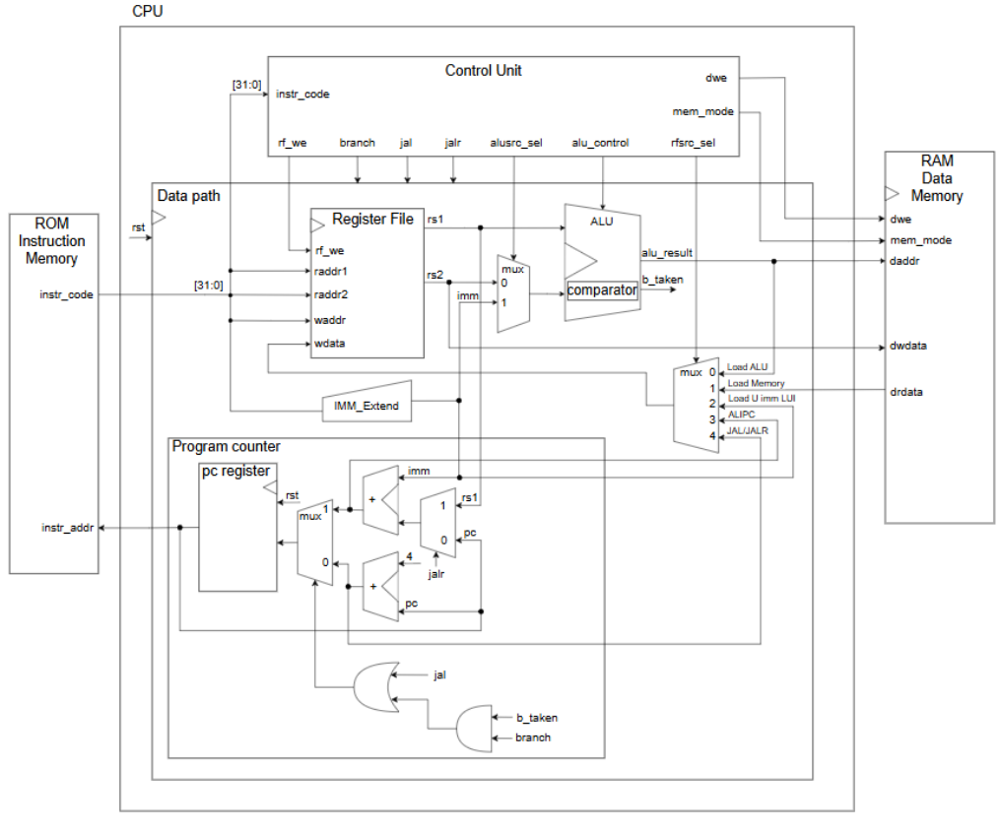
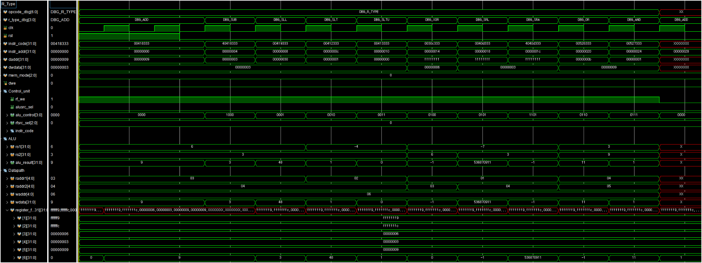
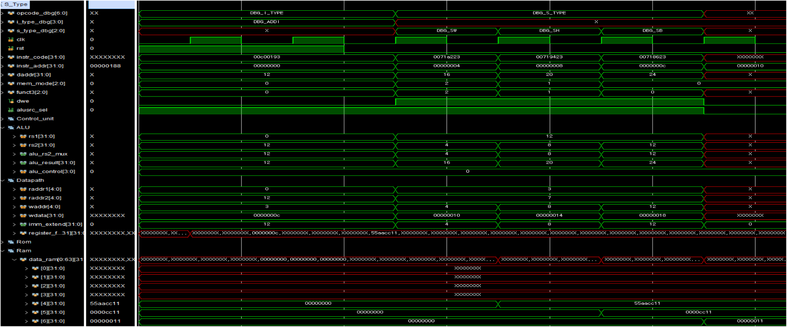
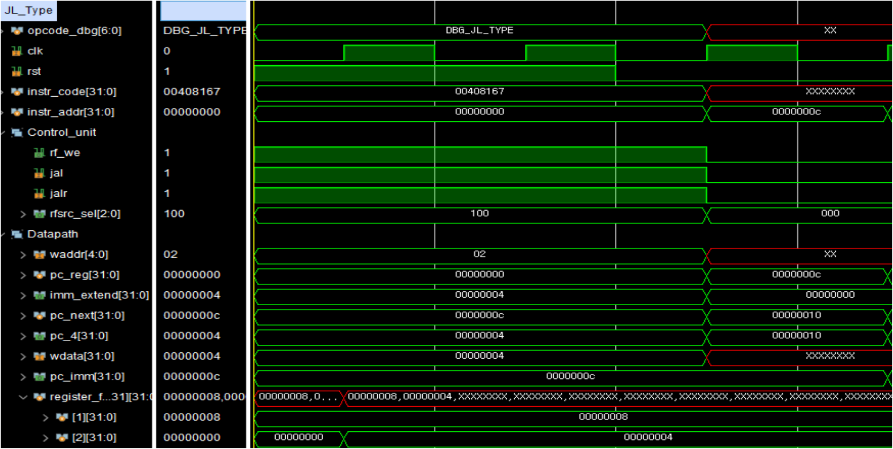
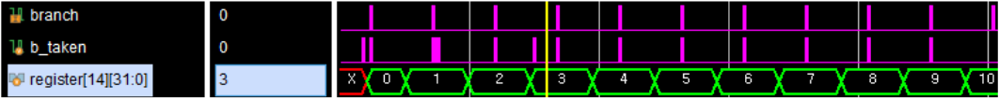
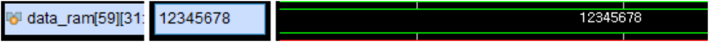
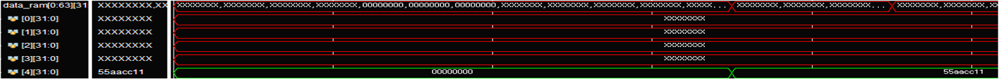
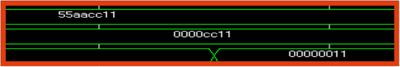

# RV32I Single-Cycle CPU

SystemVerilog로 RISC-V RV32I 명령어 37개를 구현한 Single-Cycle CPU입니다. 명령어 타입별 RTL 시뮬레이션과 C 코드 기반 누적합 프로그램을 실행해 Control Unit, Data Path, Memory, Program Counter의 통합 동작을 확인했습니다.

- 개발 기간: 2026.05.19 ~ 2026.05.27
- 개발 환경: Xilinx Vivado 2020.2, Vivado Simulator, RISC-V GCC
- 사용 언어: SystemVerilog, C, RISC-V Assembly
- 주요 결과: RV32I 37개 명령어 구현 및 1~10 누적합 결과 55 확인

## 1. 프로젝트 목표

- RV32I 명령어 형식을 해석해 CPU 제어 신호를 생성합니다.
- Program Counter, Register File, ALU, Immediate Generator, Memory를 하나의 Data Path로 연결합니다.
- 명령어 타입별 시뮬레이션으로 연산 결과와 제어 신호를 확인합니다.
- C 코드를 RISC-V 명령어로 변환해 직접 설계한 CPU에서 실행합니다.

## 2. 설계 구조

### 주요 모듈

- top_rv32i_soc: Instruction Memory, CPU, Data Memory를 통합합니다.
- rv32i_cpu: Control Unit과 Data Path를 연결합니다.
- control_unit: opcode, funct3, funct7을 해석해 제어 신호를 생성합니다.
- datapath: PC, Register File, ALU, Immediate, Write Back 경로를 구성합니다.
- instruction_mem: 32-bit 명령어를 저장하고 PC가 가리키는 명령어를 출력합니다.
- data_mem: Byte, Half Word, Word 단위의 Load와 Store를 처리합니다.

모든 명령어는 한 Clock Cycle 안에서 명령어 해석, 연산, Memory 접근, Write Back을 수행합니다. Clock Edge에서 Program Counter와 Register File, Data Memory가 갱신됩니다.

## 3. 구현 명령어

- R-Type 10개: ADD, SUB, SLL, SLT, SLTU, XOR, SRL, SRA, OR, AND
- I-Type 9개: ADDI, SLLI, SLTI, SLTIU, XORI, SRLI, SRAI, ORI, ANDI
- Load 5개: LB, LH, LW, LBU, LHU
- Store 3개: SB, SH, SW
- Branch 6개: BEQ, BNE, BLT, BGE, BLTU, BGEU
- U-Type 2개: LUI, AUIPC
- Jump 2개: JAL, JALR
- 총 37개 명령어

Control Unit은 명령어에 따라 rf_we, branch, jal, jalr, alusrc_sel, alu_control, rfsrc_sel, mem_mode, dwe를 생성합니다. Write Back MUX는 ALU 결과, Load Data, Upper Immediate, PC + Immediate, PC + 4 중 하나를 Register File에 기록합니다.

## 4. 명령어 타입별 검증

### R-Type

R-Type 10개 명령어를 순차 실행해 산술, 논리, Shift, Signed/Unsigned 비교 결과를 확인했습니다. 특히 SLT와 SLTU, SRL과 SRA를 비교해 부호 처리 차이가 Data Path에 반영되는지 검증했습니다.

### Load와 Store

LB, LH, LW, LBU, LHU의 부호 확장과 제로 확장을 확인했습니다. SB, SH, SW는 저장 폭과 Byte Address 선택 동작을 검증했습니다.

### Branch와 Jump

Branch 명령어의 Signed/Unsigned 조건 비교와 Branch Target 선택을 확인했습니다. JAL과 JALR에서는 PC + 4가 Return Address로 저장되고, Immediate 또는 rs1 + Immediate가 다음 PC로 선택되는지 확인했습니다.

## 5. C 코드 기반 CPU 통합 검증

1부터 10까지 더하는 C 프로그램을 RISC-V GCC로 Assembly와 Machine Code로 변환한 뒤 instruction_code.mem에 저장했습니다.

프로그램은 a를 1씩 증가시키면서 adder 함수를 호출해 sum에 누적합니다. 반복문 종료 후 0x12345678을 저장하고 동일한 PC 주소를 반복하는 Halt Loop에 진입합니다.

- 반복 횟수: 10회
- 최종 누적합: 55
- 누적합 저장 위치: data_ram[58], Byte Address 232
- 완료 표시값: 0x12345678
- 완료 표시값 저장 위치: data_ram[59], Byte Address 236
- 함수 호출과 복귀: JAL과 JALR
- 종료 상태: 동일 PC 주소를 반복하는 Halt Loop

반복 횟수가 0부터 10까지 증가하는 과정입니다.

프로그램 종료 후 완료 표시값이 data_ram[59]에 저장된 결과입니다.

## 6. Troubleshooting

초기 S-Type 검증에서는 SW, SH, SB 수행 후 Memory 값의 변화가 파형에서 명확히 구분되지 않았습니다.

- 원인: 초기값 0x55AACC11의 하위 Byte가 각 명령어의 저장 결과와 겹쳤습니다.
- 원인: 동일한 Memory 주소를 연속해서 사용해 정상 동작해도 값의 변화가 잘 보이지 않았습니다.
- 해결: SW, SH, SB가 서로 다른 주소를 사용하도록 Testbench 시나리오를 변경했습니다.
- 결과: Word, Half Word, Byte 저장 결과를 독립적으로 확인했습니다.

수정 전에는 저장 범위의 차이를 파형에서 구분하기 어려웠습니다.

수정 후에는 SW, SH, SB 결과가 각각 55AACC11, 0000CC11, 00000011로 구분됩니다.

## 7. 디렉터리 구성

- rtl
  - CPU, Control Unit, Data Path, Memory RTL
  - instruction_code.mem
  - instruction_mem_sort.mem
- sim
  - tb_rv32i.sv
- docs/images
  - Architecture와 시뮬레이션 결과 이미지

## 8. Vivado Simulation

1. Vivado 2020.2에서 RTL Project를 생성합니다.
2. rtl 폴더의 SystemVerilog 파일과 define.vh를 Design Sources에 추가합니다.
3. instruction_code.mem을 Memory Initialization File로 추가합니다.
4. sim 폴더의 tb_rv32i.sv를 Simulation Sources에 추가합니다.
5. Simulation Top을 tb_rv32i로 설정하고 Behavioral Simulation을 실행합니다.

instruction_mem.sv는 instruction_code.mem에 저장된 32-bit Hex Machine Code를 Instruction Memory로 불러옵니다. 다른 프로그램을 실행할 때는 변환한 Machine Code로 해당 파일을 교체하면 됩니다.
